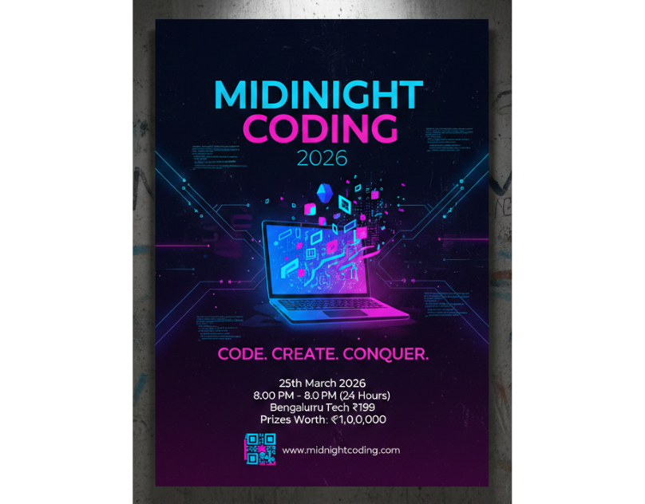

# 🌌 Midnight Coding 2026 – Event Poster Design

A futuristic neon-themed poster created for a 24-hour coding hackathon event.

---

## 📌 Project Overview

**Event Name:** Midnight Coding 2026  
**Tagline:** Code. Create. Conquer.  
**Category:** Event Poster Design  
**Audience:** Students, Developers, Tech Enthusiasts  

This project showcases a modern cyberpunk-inspired poster designed to attract participants to a 24-hour hackathon event. The goal was to create an energetic, bold, and futuristic visual experience.

---

## 🎯 Design Objectives

- Create a strong visual impact using neon lighting
- Establish clear typography hierarchy
- Maintain proper layout balance
- Highlight key event details clearly
- Use modern tech-inspired design elements

---

## 🎨 Design Style

- Dark gradient background (Navy to Deep Purple)
- Neon Blue & Electric Pink accents
- Glowing laptop illustration as focal point
- Digital UI elements and code-inspired graphics
- Circuit-style visual lines
- Bold modern sans-serif typography

---

## 🎨 Color Palette

| Color Name       | Hex Code  |
|------------------|-----------|
| Neon Blue        | #00CFFF   |
| Electric Pink    | #FF2D95   |
| Deep Purple      | #1B0033   |
| Dark Navy        | #0A0F2C   |

---

## 🛠 Tools Used

- Canva / Figma / Photoshop  
- Poster Mockup for presentation  

---

## 📦 Deliverables

- High-Resolution Poster Design  
- Mockup Presentation  
- Editable Source File  

---

## 💡 Skills Demonstrated

- Event Branding  
- Poster Layout Composition  
- Typography Hierarchy  
- Color Theory Application  
- Visual Balance  
- Tech-Themed Graphic Design  

---

## 🚀 About the Designer

I am a Graphic & Visual Designer passionate about creating impactful branding and promotional designs.

If you like this project, feel free to ⭐ star the repository!

---
